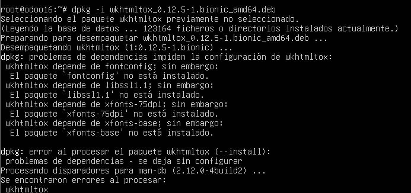
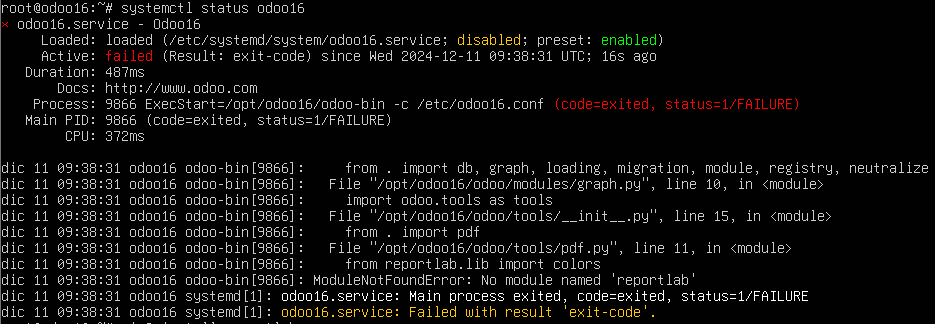
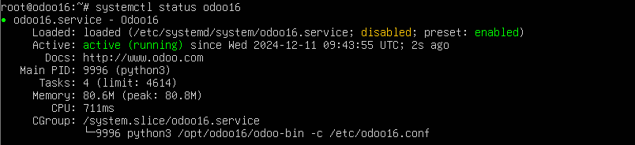
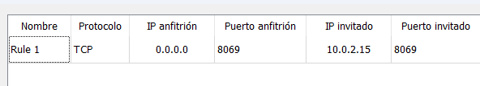
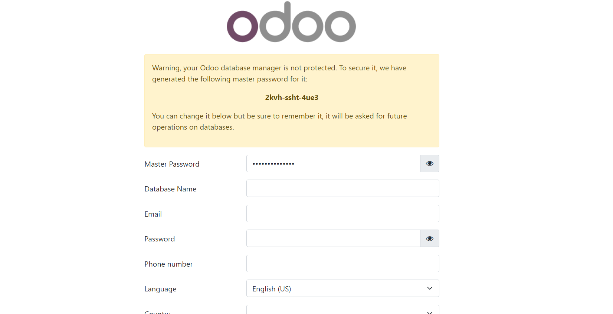

# GuiaInstalacionOdoo
## Instalación Servidor Ubuntu
En primer lugar lo primero será crear una maquina virtual donde poder instalar el sistema Odoo. Para ello crearemos un ubuntu server en Virtual Box.
Cuando termine la instalacion hacemos un update-upgrade del servidor para tener todos los paquetes actualizados y no tener problemas de compatibilidad mas adelante.

Para todos los comandos a continuación he usado el superuser root por lo que no he escrito sudo previo a los comandos.
Para ello usamos los siguientes comandos: 
sudo passwd root
su - root

## Instalamos las librerias que necesitaremos para Odoo con el comando: apt-get install  

apt-get install python3-pip python-dev-is-python3 python3-dev libxml2-dev libxslt1-dev zlib1g-dev libsasl2-dev libldap2-dev build-essential libssl-dev libffi-dev libmysqlclient-dev libjpeg-dev libpq-dev libjpeg8-dev liblcms2-dev libblas-dev libatlas-base-dev npm node-less

## Creamos un link simbolico.
ln -s /usr/bin/nodejs /usr/bin/node
### Instalamos todos los paquetes de node con el comando 
npm install -g less less-plugin-clean-css

## Ahora instalamos postgresql, necesario para Odoo.
apt-get install postgresql
## Accedemos al usuario postgres.
su - postgres

Creamos el usuario odoo16 para la postgresql con el comando: createuser --createdb --username postgres --no-createrole --no-superuser --pwprompt odoo16

Entramos a postgresql 
psql

Le damos los permisos al usuario odoo16 de superuser.

alter user odoo16 with superuser;
y salimos de la bd con
\q
Nos pasamos al usuario root para el siguiente paso.
Ahora añadimos el usuario al sistema para poder usarlo.
adduser --system --home=/opt/odoo16 --group odoo16

Con todo preparado necesitamos instalar git para poder descargar el repositorio de Odoo. 
apt-get install git
ahora corremos un bash en el usuario odoo16.
su - odoo17 -s /bin/bash
clonamos el repositorio de Odoo en la carpeta raiz del usuario.
git clone https://www.github.com/odoo/odoo --depth 1 --branch 16.0 --single-branch . 

Ahora salimos del usuario odoo16 con exit

Para instalar todos los requerimientos de odoo16 aplicamos python install sobre el archivo que indica todos los requerimientos.
pip3 install -r /opt/odoo16/requirements.txt
Salta un error que se corrige borrando el archivo externally-managed.
rm /usr/lib/python3.12/EXTERNALLY-MANAGED
Ahora instalaremos wkhtmltopdf por lo que hacemos wget y despues dpkg.
wget https://github.com/wkhtmltopdf/wkhtmltopdf/releases/download/0.12.5/wkhtmltox_0.12.5-1.bionic_amd64.deb  
Ahora lo instalamos con el comando:
dpkg -i wkhtmltox_0.12.5-1.bionic_amd64.deb
Aqui salta un error con algunos paquetes que no estan instalados.

Al no ser un componente indispensable para el odoo seguimos adelante.
Tras esto copiamos el archivo de configuracion en la carpeta /etc
cp /opt/odoo16/debian/odoo.conf /etc/odoo16.conf
Ahora modificamos el archivo de configuración.
nano /etc/odoo16.conf
Le damos los permisos al usuario odoo16
chown odoo16 /etc/odoo16.conf
chmod 640 /etc/odoo16.conf
mkdir /var/log/odoo
chown odoo16:root /var/log/odoo
nano /etc/systemd/system/odoo16.service

[Unit]
   Description=Odoo16
   Documentation=http://www.odoo.com
   [Service]
   "#" Ubuntu/Debian convention:
   Type=simple
   User=odoo16
   ExecStart=/opt/odoo16/odoo-bin -c /etc/odoo16.conf
   [Install]
   WantedBy=default.target
   
   Adjudicamos permisos:
   chmod 755 /etc/systemd/system/odoo16.conf
   chown root /etc/systemd/system/odoo16.conf
   chown root: /etc/systemd/system/odoo16.conf
   Lanzamos el servicio de odoo16
   systemctl start odoo16
   Chequeamos el estado del servicio.
   systemctl status odoo16
   Salta error por falta de paquetes.
   
   Procedemos a instalarlos.
   pip3 install lxml.html.clean
   pip3 install decorator
   Tras esto iniciamos el servicio y vemos el estado.
   
   Ahora debido a que la conexión de la maquina virtual es NAT hago una redireccion de puertos a la maquina anfitriona.
   
   Tras esto conectamos al puerto correspondiente y ¡Conexión! 
   