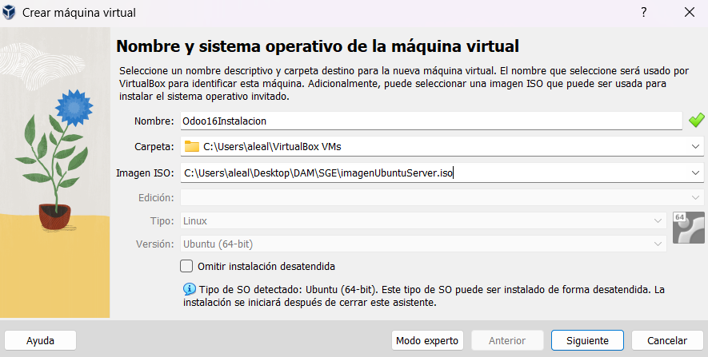

# GuiaInstalacionOdoo
En primer lugar lo primero será crear una maquina virtual donde poder instalar el sistema Odoo. Para ello crearemos un ubuntu server en Virtual Box.

Cuando termine la instalacion hacemos un update-upgrade del servidor para tener todos los paquetes actualizados y no tener problemas de compatibilidad mas adelante.

Instalamos la libreria pytohn que necesitaremos para Odoo con el comando.
apt-get install  python3-pip
Tras esto instalamos mas librerias necesarias con el comando apt-get install python-dev-is-python3 python3-dev libxml2-dev libxslt1-dev zlib1g-dev libsasl2-dev libldap2-dev build-essential libssl-dev libffi-dev libmysqlclient-dev libjpeg-dev libpq-dev libjpeg8-dev liblcms2-dev libblas-dev libatlas-base-dev npm node-less
Con el comando apt-get install npm instalara todo lo necesario para node.
Creamos un link simbolico.
ln -s /usr/bin/nodejs /usr/bin/node
Instalamos todos los paquetes de node con el comando npm install -g less less-plugin-clean-css
apt-get install node-less
Ahora instalamos postgresql, necesario para Odoo. apt-get install postgresql
Accedemos al usuario postgres.
su - postgres
Creamos el usuario odoo17 para la postgresql con el comando. createuser --createdb --username postgres --no-createrole --no-superuser --pwprompt odoo17
Entramos a postgresql 
psql
Le damos los permisos al usuario odoo17 de superuser.
alter user odoo17 with superuser;
y salimos de la bd con
\q
Ahora añadimos el usuario al sistema para poder usarlo.
adduser --system --home=/opt/odoo17 --group odoo17
Con todo preparado necesitamos instalar git para poder descargar el repositorio de Odoo. 
apt-get install git
ahora corremos un bash en el usuario odoo17 
su - odoo17 -s /bin/bash
clonamos el repositorio de Odoo en la carpeta raiz del usuario.
git clone https://www.github.com/odoo/odoo --depth 1 -branch 17.0 --single-branch . 
Para instalar todos los requerimientos de odoo17 aplicamos python install sobre el archivo que indica todos los requerimientos.
pip3 install -r /opt/odoo17/requirements.txt
Salta un error que se corrige borrando el archivo externally-managed.
rm /usr/lib/python3.12/EXTERNALLY-MANAGED
wget https://github.com/wkhtmltopdf/wkhtmltopdf/releases/download/0.12.5/wkhtmltox_0.12.5-1.bionic_amd64.deb  
